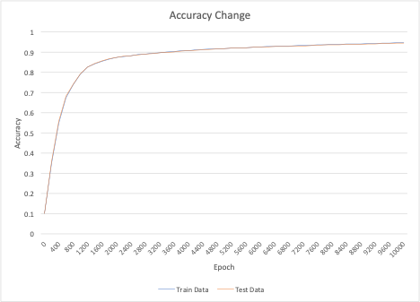
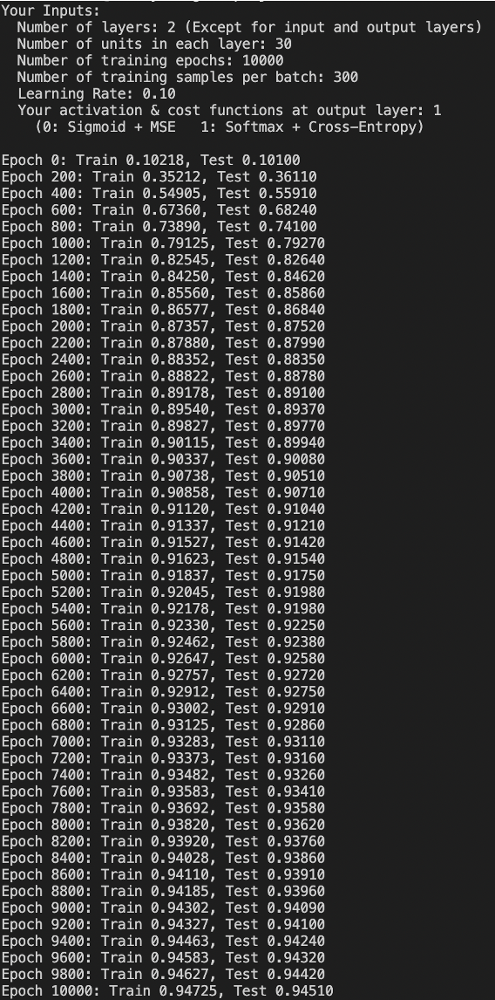

# NN for classifying MNIST dataset
## Brief Description
This repository implements multilayer neural networks from scratch and train it using stochastic gradient descent on the training dataset of the [MNIST database of handwritten digits](http://yann.lecun.com/exdb/mnist/) using Python, C, and CUDA.

## Set up
``` sh
bash getdata.sh
make
```

## Implementation
### Serial Version
``` sh
./serial 2 30 300 6000 0.1 1 100
```
Arguments:
- Number of layers: 2 (Except for input and output layers)
- Number of units in each layer: 30
- Number of training epochs: 300
- Number of training samples per batch: 6000
- Learning Rate: 0.10
- Activation & cost functions at output layer: 1 
  - (0: Sigmoid + MSE  1: Softmax + Cross-Entropy)

### Cuda Version
Note that you need NVIDIA CUDA environment to run this.
``` sh
./cuda 2 30 300 6000 0.1 1 100
```
Arguments (same to serial version):
- Number of layers: 2 (Except for input and output layers)
- Number of units in each layer: 30
- Number of training epochs: 300
- Number of training samples per batch: 6000
- Learning Rate: 0.10
- Activation & cost functions at output layer: 1 
  - (0: Sigmoid + MSE  1: Softmax + Cross-Entropy)

## Coding Algorithms
The basic algorithm I used is the following. In the CUDA code, I used GPU from L4 to L8 in this. Each thread calculates one image’s feedforward/backpropagate/gradient-descent process (the gradient-descent process is distributed to each image’s process).

L1  for each epoch
L2      output error
L3      sample batch
L4      for each image in batch
L5          feedforward
L6          backpropagate
L7      end
L8      gradient descent
L9  end

## Sample Results
1. Setting
    - Number of layers: 2 (Except for input and output layers)
    - Number of units in each layer: 30
    - Number of training epochs: 10000
    - Number of training samples per batch: 300
    - Learning Rate: 0.10
    - Activation & cost functions at output layer: Softmax + Cross-Entropy

2. Notes
About the output picture (screenshot of command-line interface):
    - “Train:” means the accuracy which is calculated with train data and updated weights/biases.
    - “Test:” means the accuracy which is calculated with test data and updated weights/biases.

3. Results
The serial code achieved around 95% accuracy for both train and test data. The accuracies changed like the following graph and picture. 

<p align="center">
  
  
</p>


